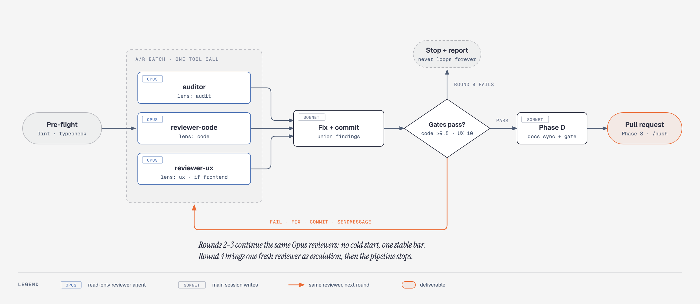
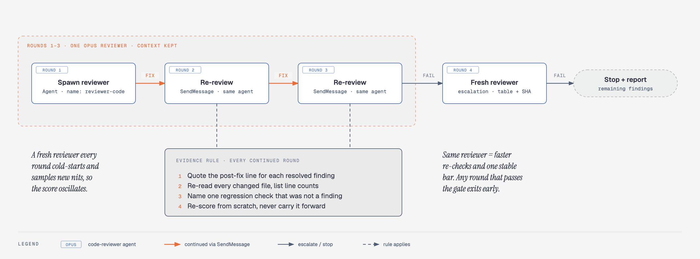
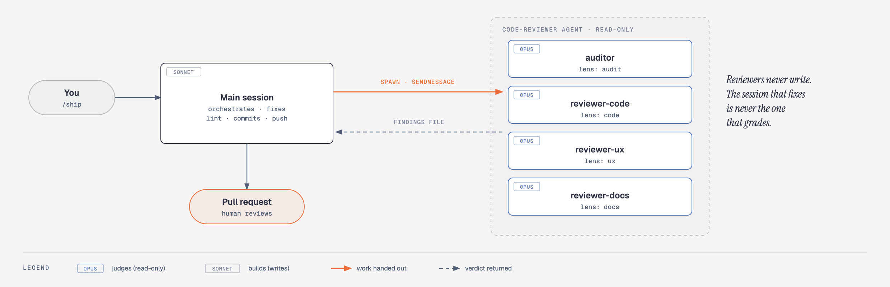

<div align="center">

# ⚓ shipwright

**From "done coding" to "PR ready for review" in one command.**<br>
Opus reviews your work, Sonnet fixes what it finds, and the same reviewer re-checks every fix.

[](LICENSE)
[](https://docs.anthropic.com/en/docs/claude-code)
[](skills/)
[-2e5aa8)](agents/)
[](https://github.com/cloverink/shipwright/releases)

</div>

```
/ship
```

That's it. shipwright audits and reviews your branch with parallel Opus reviewers, fixes every finding, loops
until the quality gates pass, syncs the docs, and opens a PR. It never deploys, never merges, and never loops
forever.

---

## How /ship works

<picture>
  <source media="(prefers-color-scheme: dark)" srcset="docs/assets/ship-pipeline-dark.png">
  
</picture>

| Step | What happens | Who |
|---|---|---|
| **Pre-flight** | Blocks on `main` or an empty diff, runs lint + typecheck, commits leftovers | main session |
| **A/R batch** | Audit, code review and UX review spawn **together** in one tool call over the same diff | 3 × Opus `code-reviewer` |
| **Fix + commit** | Findings are unioned, fixed one writer per file, linted, committed as one round | main session (Sonnet) |
| **Gate loop** | Code ≥ 9.5 and UX = 10? No → the **same** reviewers re-check the fix. Round 4 is a fresh reviewer, then stop | same Opus reviewers |
| **Phase D** | Docs synced against everything that shipped, verified by a binary docs gate | Sonnet + Opus |
| **Phase S** | Rebase, push, open a PR carrying the round table and any leftover Suggestions | main session |

## Why it's fast: the same reviewer re-checks the fix

<picture>
  <source media="(prefers-color-scheme: dark)" srcset="docs/assets/reviewer-continuity-dark.png">
  
</picture>

The naive fix loop spawns a new reviewer every round. Each one cold-starts, re-reads every rule and file, forgets what
it already flagged, and **finds a fresh set of nits**. We watched a UX gate bounce `9 → 8 → 9 → 7 → 10` over five
rounds on the same diff.

shipwright keeps **one reviewer per gate**:

- 🔁 **Rounds 1-3: continuity.** The round-1 reviewer is spawned by name and continued with `SendMessage`. It
  already holds the rules, the files and its own findings, so a re-check is quick and the bar stays put.
- 🧾 **Evidence rule.** A continued reviewer must quote the post-fix lines, list every file it re-read, name one
  regression check, and re-score from scratch. No evidence, no pass.
- 🆕 **Round 4: escalation.** Still failing after three rounds? One fresh reviewer gives an independent verdict. Still
  failing → stop and report. No infinite loops.

Deep dive: [Reviewer Continuity pattern](patterns/reviewer-continuity.md).

## Opus judges, Sonnet builds

<picture>
  <source media="(prefers-color-scheme: dark)" srcset="docs/assets/roles-dark.png">
  
</picture>

- **Every verdict comes from Opus.** The plugin ships one read-only agent, [`code-reviewer`](agents/code-reviewer.md)
  (`model: opus`, tools `Read, Grep, Glob, Bash`), loaded with a different lens per job.
- **Every edit comes from the main session.** A reviewer that fixes its own findings is grading its own homework.
- **Findings go to a file, not a reply.** Subagent replies sometimes get lost. Each reviewer appends to a
  `STATUS: RUNNING` file and flips it to `DONE`, so a crashed lens is visible instead of silently green.
- **The main session drives.** `/ship` never hands the whole pipeline to one subagent: that shape is serial, reviews
  its own fixes, and can't keep a reviewer alive across rounds.

---

## Install

In any Claude Code session:

```
/plugin marketplace add cloverink/shipwright
/plugin install shipwright@shipwright
```

Then run `/ship`, `/review-full`, `/push` and friends. The reviewer agent is available as `shipwright:code-reviewer`.

<details>
<summary>Alternative install methods</summary>

**Symlink (for developing this repo)**

```bash
git clone https://github.com/cloverink/shipwright.git
cd shipwright
./scripts/link-skills.sh     # links skills/* → ~/.claude/skills, agents/* → ~/.claude/agents
```

**Manual copy (into one project)**

```bash
cp -r skills/* /path/to/project/.claude/skills/
cp agents/*.md /path/to/project/.claude/agents/     # the review skills need the code-reviewer agent
```

</details>

## Skills

Sorted by `/ship` pipeline order, then standalone utilities.

| Skill | Phase | Model | What it does |
|---|---|---|---|
| [`/ship`](skills/ship/SKILL.md) | all | Sonnet | Orchestrates A/R batch → gate loop → docs → PR |
| [`/audit-full`](skills/audit-full/SKILL.md) | A | Sonnet | Branch-aware audit: whole project on `main` (one tracker issue), diff-scoped on a feature branch |
| [`/review-full`](skills/review-full/SKILL.md) | R | Sonnet | Detects scope, spawns code + UX reviewers in parallel, `--read-only` for a scored peek |
| [`/review-code-fix`](skills/review-code-fix/SKILL.md) | R | Sonnet | Code review → fix loop, gate ≥ 9.5, one reviewer across rounds |
| [`/review-ux-fix`](skills/review-ux-fix/SKILL.md) | R | Sonnet | UX review → fix loop, gate 10/10, fixes every severity |
| [`/update-docs`](skills/update-docs/SKILL.md) | D | Sonnet | Syncs tier 1-4 docs with what shipped |
| [`/review-docs`](skills/review-docs/SKILL.md) | D | Sonnet | Binary docs gate: stats, links, code-doc sync |
| [`/push`](skills/push/SKILL.md) | S | Sonnet | Safe commit + rebase + push + PR (blocks `main`) |
| [`/merge-pr`](skills/merge-pr/SKILL.md) | after | Haiku | Waits for CI → squash merge → cleanup |
| [`/parallel-builder`](skills/parallel-builder/SKILL.md) | any | Sonnet | Builds many files in parallel, conflict-free |
| [`/frontend-design`](skills/frontend-design/SKILL.md) | any | Opus | Distinctive UI, rejects generic AI aesthetics |
| [`/skill-creator`](skills/skill-creator/SKILL.md) | any | Sonnet | Guide for writing effective skills |

The **Model** column is the orchestrating session. Every review verdict, in every skill, comes from the Opus
[`code-reviewer`](agents/code-reviewer.md) agent.

### Which review skill?

**Not sure? Use `/review-full`.** It detects scope and runs the right loops.

| Situation | Use |
|---|---|
| 🟢 Any review, default | `/review-full` |
| Scores only, change nothing | `/review-full --read-only` |
| Code only, even on a frontend diff | `/review-full --code-only` or `/review-code-fix` |
| Pure CSS / spacing polish | `/review-full --ux-only` or `/review-ux-fix` |
| Docs only | `/review-docs` |
| Everything, then open a PR | `/ship` |

## Quality gates

Every reviewer starts at **10** and deducts:

| Severity | Deduction | Examples |
|---|---|---|
| 🔴 Critical | -3 | security hole, data loss, broken build |
| 🟠 Major | -1 | bug, perf regression, missing test |
| 🟡 Warning | -0.5 each, max -2 | convention violation, weak typing |
| ⚪ Suggestion | -0.1 each, max -0.5 | naming nit, small readability win |

| Gate | Pass when | Rounds |
|---|---|---|
| **Code** | score **≥ 9.5** (9.0-9.4 means a Major, two Warnings, or a Warning plus nits is open) | 3 continued + 1 fresh |
| **UX** | exactly **10/10**, zero open findings | 3 continued + 1 fresh |
| **Docs** | binary pass/fail | 2, same reviewer |

**Why Suggestions cost 0.1:** nits alone can never fail the gate (ten of them still leave 9.5), but a 10 now really
means clean, and a Warning plus a nit (9.4) gets both fixed while the reviewer is warm. When a gate fails, the loop
fixes every open finding. When it passes, leftover Suggestions go into the PR body. Full reasoning in
[Score Gates](patterns/score-gates.md).

## Patterns

The design ideas behind the skills, reusable in your own:

| Pattern | What it solves |
|---|---|
| [A→R→D→S Pipeline](patterns/ards-pipeline.md) | Phased shipping with gates, and why A and R share round 1 |
| [Reviewer Continuity](patterns/reviewer-continuity.md) | One reviewer per gate, evidence rule, fresh escalation |
| [Score Gates](patterns/score-gates.md) | Numeric thresholds with clear math |
| [Branch-Aware Mode](patterns/branch-aware-mode.md) | Same skill, different behavior on `main` vs a feature branch |
| [Phase Bundling](patterns/phase-bundling.md) | Sub-skills stage instead of commit under an orchestrator |

## Configure for your project

Every project-specific value is marked `<!-- CONFIGURE -->` in the skill files.

| Setting | Default | Change it to |
|---|---|---|
| Frontend globs | `src/components/**`, `src/pages/**`, `*.tsx`, `*.css` | your paths |
| Lint / typecheck | `npm run lint && npm run typecheck` | `pnpm …`, `bun …` |
| Dev server (UX precheck) | `http://localhost:3000` | your URL |
| Code gate | ≥ 9.5 | ≥ 8.5 internal tools, ≥ 7.5 prototypes |
| UX gate | 10/10 | 9/10 internal tools |
| Max rounds | 4 (3 continued + 1 fresh) | more escalation rounds |
| Merge strategy | `--squash` | `--merge`, `--rebase` |
| Review checklists | generic | your rules file, linked from §Review focus |

## What it does NOT do

- ❌ **Deploy.** It opens a PR. Your CI/CD deploys after merge.
- ❌ **Merge.** A human reviews the PR, then runs `/merge-pr`.
- ❌ **Force-push, skip hooks, or push to `main`.**
- ❌ **Loop forever.** Round 4 is the last one.

## Requirements

- [Claude Code](https://docs.anthropic.com/en/docs/claude-code) (CLI, desktop, or IDE extension) with access to Opus
- A git repository with an `origin/main`
- GitHub CLI (`gh`) for PRs and merging

## Contributing

See [CONTRIBUTING.md](CONTRIBUTING.md). The README diagrams are generated: edit
[`docs/diagrams/build.py`](docs/diagrams/build.py), then run `python3 docs/diagrams/build.py && python3 docs/diagrams/render.py`.

## License

[MIT](LICENSE) · Aran Chananar
