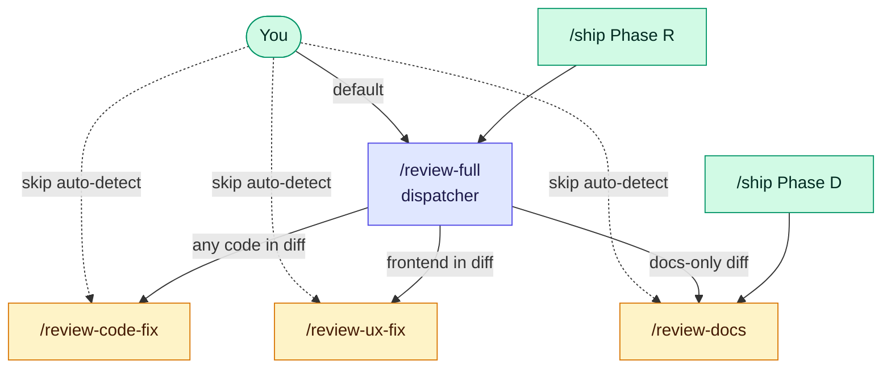
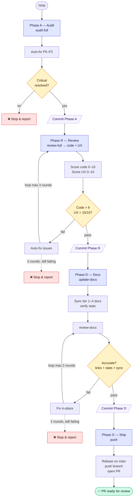

# shipwright

[](LICENSE)
[](https://docs.anthropic.com/en/docs/claude-code)
[](skills/)
[](https://github.com/cloverink/shipwright/releases)

Production-grade [Claude Code](https://docs.anthropic.com/en/docs/claude-code) skills for shipping quality code.

```
/ship
  ├── Audit      find issues, auto-fix Critical/Major
  ├── Review     code + UX review, fix until gates pass
  ├── Docs       sync documentation, verify accuracy
  └── Ship       push branch, open PR
                   ↓
              your CI/CD deploys after merge
```

One command. Four quality gates. No silent failures.

## Install

### Via Claude Code plugin marketplace (recommended)

In any Claude Code session:

```
/plugin marketplace add cloverink/shipwright
/plugin install shipwright@shipwright
```

Then invoke any skill with `/ship`, `/push`, `/review-full`, etc.

<details>
<summary>Alternative install methods</summary>

**Symlink (for development on this repo itself)**

```bash
git clone https://github.com/cloverink/shipwright.git
cd shipwright
./scripts/link-skills.sh
```

**Manual copy (into a single project)**

```bash
# All skills
cp -r skills/* /path/to/your-project/.claude/skills/

# Or pick individual ones
cp -r skills/ship /path/to/your-project/.claude/skills/

# List every shipped skill (sanity check)
./scripts/list-skills.sh
```

</details>

## Skills

All 12 skills live flat under [`skills/`](skills/) for easy discovery. Sorted below by `/ship` pipeline order, then standalone utilities.

| Skill | Phase | Model | What it does |
|-------|-------|-------|--------------|
| [`/ship`](skills/ship/SKILL.md) | — | Opus | Full A→R→D→S pipeline orchestrator with gate enforcement |
| [`/audit-full`](skills/audit-full/SKILL.md) | A | Sonnet | Branch-aware audit: whole-project on main, diff-scoped on feature |
| [`/review-full`](skills/review-full/SKILL.md) | R | Sonnet | Auto-detect scope (FE/BE/both), dispatch to code + UX review |
| [`/review-code-fix`](skills/review-code-fix/SKILL.md) | R | Opus | Code review → fix loop (max 3 rounds, gate >9/10) |
| [`/review-ux-fix`](skills/review-ux-fix/SKILL.md) | R | Opus | UX review → fix loop (max 3 rounds, gate 10/10) |
| [`/update-docs`](skills/update-docs/SKILL.md) | D | Sonnet | Sync documentation with code changes |
| [`/review-docs`](skills/review-docs/SKILL.md) | D | Opus | Verify doc updates are accurate (binary pass/fail gate) |
| [`/push`](skills/push/SKILL.md) | S | Sonnet | Smart commit + push + auto-create PR (blocks push to main) |
| [`/merge-pr`](skills/merge-pr/SKILL.md) | post-merge | Haiku | Wait for CI → squash merge → cleanup branch |
| [`/parallel-builder`](skills/parallel-builder/SKILL.md) | — | Sonnet | Build multiple files in parallel, conflict-free coordination |
| [`/frontend-design`](skills/frontend-design/SKILL.md) | — | Opus | Distinctive UI design (rejects generic AI aesthetics) |
| [`/skill-creator`](skills/skill-creator/SKILL.md) | — | Sonnet | Guide for creating effective Claude Code skills |

## Which review skill to use?

**Short answer:** if you don't know, use `/review-full`. It auto-detects scope and dispatches to the right workers.



**Decision matrix:**

| Situation | Use |
|-----------|-----|
| 🟢 Default for any review | `/review-full` |
| Force code review only (skip UX even on FE diff) | `/review-full --code-only` |
| Force UX review only (skip code) | `/review-full --ux-only` |
| Backend-only PR, want to bypass scope detection | `/review-code-fix` directly |
| Pure CSS/spacing polish, no logic changes | `/review-ux-fix` directly |
| Verify docs only (after editing docs, or as audit) | `/review-docs` directly |

**Rule of thumb:** `/review-full` covers most cases. The direct workers (`/review-code-fix`, `/review-ux-fix`, `/review-docs`) are escape hatches for when you know exactly what you want.

## How /ship works



**Key behaviors:**

- Each phase **gates the next** — Phase R only runs if Phase A's critical issues are fixed
- Fix loops have **bounded retries** (3 for review, 2 for docs) — no infinite loops
- Every phase gets its own **commit** — clean `git log` per phase
- Any stop is **loud** — pipeline reports what failed, never silently skips

## How the gates work

Every phase in `/ship` has a gate. If the gate fails, the pipeline stops and tells you why.

**Code review** — starts at 10, deducts per issue:

| Severity | Impact | Auto-fixed? |
|----------|--------|-------------|
| Critical | -3 | Yes |
| Major | -1 | Yes |
| Warning | -0.5 (max -2) | Yes |
| Suggestion | 0 | No |

Pass threshold: **>9** (strictly greater — a 9.0 means one Major issue remains).

**UX review** — target is **10/10**. Any issue at any severity fails the gate. UX issues compound: one misaligned button is invisible, three and the product feels sloppy.

**Fix loops** — review → fix → re-review, up to 3 rounds. If the gate still fails after 3 rounds, the pipeline stops and reports remaining issues.

## Patterns

These skills share four reusable design patterns:

| Pattern | What it solves |
|---------|---------------|
| [A→R→D→S Pipeline](patterns/ards-pipeline.md) | Sequential phases with gate enforcement |
| [Score Gates](patterns/score-gates.md) | Numeric quality thresholds with clear math |
| [Branch-Aware Mode](patterns/branch-aware-mode.md) | Same skill, different behavior on main vs feature branch |
| [Phase Bundling](patterns/phase-bundling.md) | Sub-skills suppress commits when called from orchestrator |

## Configuring for your project

Every project-specific value is marked with `<!-- CONFIGURE -->` in the skill files. Common adjustments:

| Setting | Default | Example change |
|---------|---------|----------------|
| Frontend paths | `src/components/**` | Your source directory |
| Backend paths | `src/api/**` | Your source directory |
| Build command | `npm run build` | `pnpm build`, `bun run build` |
| Code review bar | >9 | >8 for internal tools, >7 for prototypes |
| UX review bar | 10/10 | 9/10 for internal tools |
| Merge strategy | `--squash` | `--merge`, `--rebase` |
| Commit format | Conventional Commits | Your convention |

## Model recommendations

| Tier | Skills | Why this model |
|------|--------|----------------|
| **Opus** | `/ship`, `/review-code-fix`, `/review-ux-fix`, `/review-docs`, `/frontend-design` | Quality gates and creative work need the deepest reasoning |
| **Sonnet** | `/review-full`, `/audit-full`, `/update-docs`, `/push`, `/parallel-builder`, `/skill-creator` | Coordination and dispatching — moderate complexity |
| **Haiku** | `/merge-pr` | Mechanical — wait for CI, run one command |

Cost-conscious? Downgrade Opus → Sonnet on review skills, but expect lower review quality. The quality gates exist because the model behind them is good enough to enforce them.

## Requirements

- [Claude Code](https://docs.anthropic.com/en/docs/claude-code) CLI or IDE extension
- Git repository
- GitHub CLI (`gh`) for PR creation and merging

## License

[MIT](LICENSE) — Aran Chananar
